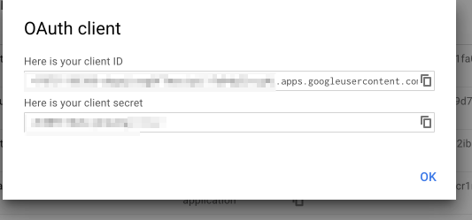
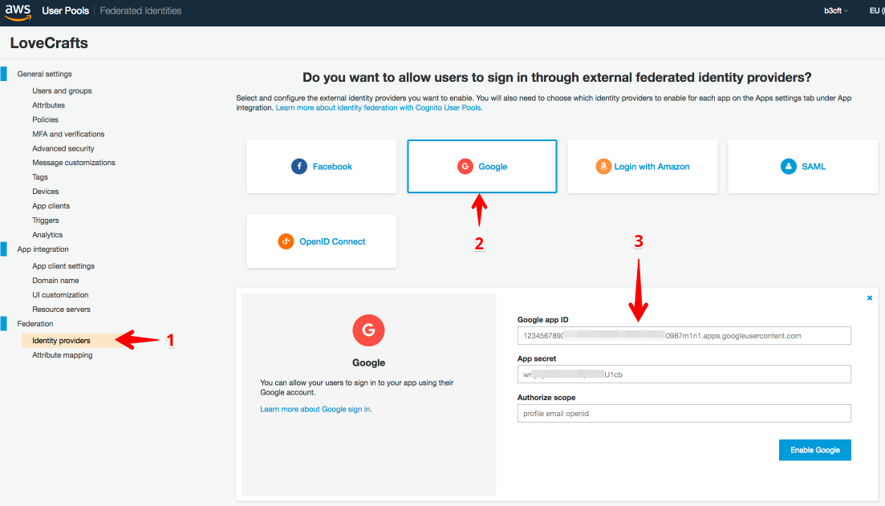
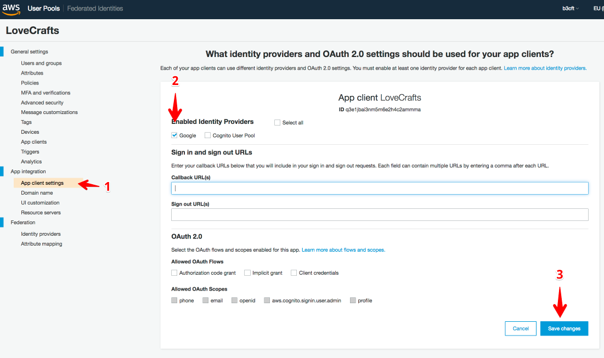
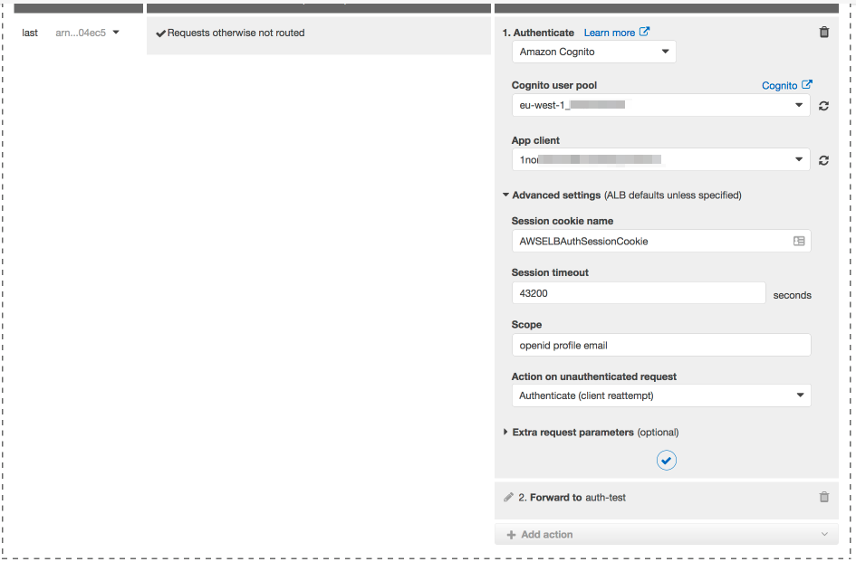
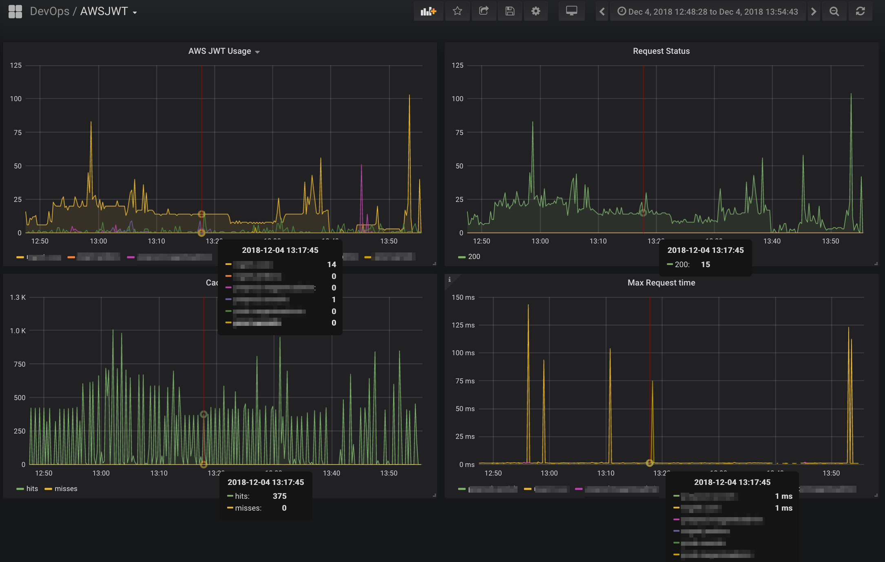

# Quick and easy BeyondCorp BackOffice access with ALBs, Cognito and Gsuite

For some values of quick and easy.

## Overview

LoveCrafts have several services which are currently hosted behind serveral different VPNs. VPN access is managed via LDAP which is managed by Engineering/DevOps.

Historically we have not been notified of company leavers in a timely fashion, which is an obvious security hole, as VPN access (can) permit access to privileged resources within our hosting environment.

This includes but is not limited to

* Grafana
* Kibana
* Jenkins

For a while we had been discussing some kind of Single Sign On (SSO) system to manage access to all these disparate systems. We use Google GSuite for corporate mail and our Human Resources Team add and remove people as they join and leave, including contractors. So it seemed obvious to treat Google as our single source of truth (or as good as we have for now anyway).

In June 2018 AWS announced the integration of Cognito and JWT Authorisation within their Application Load Balancers (ALBs). <a name="ref1-return" ></a>[[1]](#ref1)

This would allow any Web Based back office services to be put behind a public facing ALB with Cognito Authorisation via GSuite.

This probably equates to 90% of our corporate VPN traffic. Theoretically we should then be able to get the required VPN services to be used *only* for emergency SSH/RDP and we could look limit SSH access as much as possible with other tooling, such as SSM Manager Console.

Integrating with GSuite gets LoveCrafts significantly closer to a full SSO.

_Caveat Developer_:
The following code and examples have been reverse engineered from our code and infrastucture. The examples should work if you attempt to use them, but we deploy with puppet. I've attempted to make them work standalone but there may be some inconsistencies.

## Initial Proof of concept

To test this was feasible before going ahead with a full implementation a test AWS account was choosen and I created a:

* Cognito User Pool
* Cognito App Client
* Application Load Balancer
* Google OAuth2 Client Credentials

The ALB was configured with a separate CNAME to an existing service.

The Google OAuth2 Client credentials were configured and added to the Cognito User Pool in the testing account.

Enabling the authentication, all https access to the ALB was redirected to a Google auth page and redirected back to the ALB once sign in was complete.

Transparent access worked fine, and a user was added to the Cognito Pool.

Access was allowed to the protected resource once authenticated or repeatedly presented a Google Authetication page.

### The Good

Works transparently without having to write any app specific code. Zero to up and running in ~5mins.

AWS ALB passes the user profile data in a `X-Amzn-Oidc-Data` http header that the app/nginx etc can access (although it is base64 encoded json)

### The Bad

**Any** Google account permits access. (This service is designed to allow app developers to pass off user management via Google, Twitter, Facebook or any OAuth2/OpenID platform and store in Cognito.)

The App needs to validate JWT Token to prove authenticity of the `X-Amzn-Oidc-Data` http header, which is great because we're already using an nginx JWT auth library...

### The Ugly

Initially it was relatively trivial to get Nginx to decode the X-Amzn-Oidc-Data Header, extract the Username/email/firstname/lastname and pass as separate headers to the downstream app.

However you need validate the signature of the JWT token to ensure it's genuine (in time (i.e, session is still valid) and that it hasn't been spoofed).

Amazon chose to use ES256 signatures for JWT, which the nginx lua library we've been using doesn't support and I couldn't find one which did support any Elliptical Curve Crypto Signatures. Well there was a Kong version of nginx but I didn't want to attempt back porting.

What follows is an explanation of the solution I ended up writing; a python sidecar to handle the JWT validation, user data extraction and encapsulated the functionality in a new lua module for nginx.

Once/If the nginx lua JWT module improves to support ES crypto this could be deprecated in favour of a fully lua based module.

For speed of development I chose to write a python sidecar app to validate the JWT token and return http headers back to nginx. The http status code indicates whether the JWT token validated correctly. 

The python app runs under gunicorn. It needs to be run under python3, as again, python2 doesn't have support for the crypto libraries in use.

Using a python app does also allow you to expand the features and add group memberships from a LDAP service as extra headers for example.

I finally settled on the PyJWT library as it compiled and performed serveral orders of magnitude faster than a userland version. (less than 1ms typically compared to 150ms+). Speed is critical here, as the JWT token needs to be validated for every single request crossing the ALB.

## Basic Implementation

To follow along you will need:

* A Google GSuite account and developer access
* An AWS account with an ALB and a Cognito Pool
* nginx with lua support
* python3

We're going to run a python3 sidecar AuthService that validates the JWT token and passes the validated headers back to nginx. Nginx will then forward those headers to your own application behind the ALB. The application does not need to know anything about how the authentication is done and could even be a static site.
Applications such as Grafana and Jenkins can use the Proxy Headers as a trusted identity.

The `AuthService` sidecar runs locally along side the Nginx instance and has strictly controlled timeouts. If the JWT authorisation is required and the service is down, nginx will serve a `503: Service Unavailable`. If the user is authenticated but not in the list of approved domains, the nginx will serve a `401: Access denied`.

Below shows the standard request path for an initial login to a Cognito ALB.


**Nginx** and **AuthServices** are the two components we need to build to validate the JWT token.

**Keyserver** is a publically accessible location to retreive the public key of the server that signed the JWT token. The key id is embedded in the `X-Amzn-Oicd-Data` header. The python app caches the public keys in memory.

### Creating GSuite OAuth2 Credentials

Login into the [Google Developers Console](https://console.developers.google.com/apis/credentials) and create an app to use for authentication.

Create OAuth Client Credentials for your app.


Create a set of web application credentials.


Copy your `Client ID` add `Secret`



### Configure Cognito

If you don't already have a `Cognito User Pool` create one.

Choose the domain name that Cognito will reserve for you. This is where your users will get directed to to login. (You can use your own domain, but is beyond the scope of this tutorial.)


Pick your domain prefix. 

**N.B.** The full domain needs to added the Google Developer Console as a permitted Callback location for your Oauth Web Client app.


Configure Google as your identify provider. 
Paste in your `Client ID` and `Secret` from Google here.


Configure the ALB Endpoints for the Cognito Appl Client.


If, for example, your test application is being hosted on `testapp.mycorp.com`. 

Your Callback urls will be `https://testapp.mycorp.com,https://testapp.mycorp.com/oauth2/idpresponse`

The `/oauth2/idpresponse` url is handled by the ALB internally and your app will not see these requests.<a name="ref2-return" ></a>[[2]](#ref2)

Your Sign out URL will be `https://testapp.mycorp.com`

You can keep appending more ALBs and endpoints to this config later, comma separated.

### Configure ALB

Now we can configure the ALB to force authentication when accessing all or part of our Webapp.

On your ALB, select the listeners tab and edit the rules for the HTTPS listener (you can **only** configure this on an https listener).



The `Cognito user pool` is from our previous step, and the `App client` is the client configured within the Cognito User Pool.

I reduce the `Session timeout` down to approximately 12 hours, as the default is 7 days.

From this point on, the ALB *only* ensures that there a valid session with *any* Google account, even a personal one. There is no way to restrict which email domains to permit in Cognito.

### Configure Nginx

You will need nginx running with lua support and the `resty.http` lua package available as well as this custom lua script:

[nginx-aws-jwt.lua](nginx-aws-jwt.lua)

Our code is configured and managed by puppet, so you will need to substitute some values with appropriate values (timeouts, valid_domains etc.)

Inside your nginx `http` block:

```nginx
lua_package_path "<<path_to_lua_packages>>/?.lua;;";
```

Then inside your `server` block add the following `access_by_lua` code to your `location` block:

```nginx
location / {
     access_by_lua '
         local jwt = require("nginx-aws-jwt")
         jwt.auth{auth_req=false}
     ';
}
```

`auth_req` defaults to `true`. If true, this will issue a `401: Access denied` unless a valid AWS JWT token exists and the user's email address is in the list of `valid_domains` e.g. (`mycorp.com, myparentcorp.com`)

The `false` setting, as shown, enables a soft launch and will instrument the backend request with extra headers if a valid JWT token is present and otherwise permit access as normal.

The only other parameter currently supported is valid_domains. And should be used as such.

```nginx
location / {
    access_by_lua '
        local jwt = require("nginx-aws-jwt")
        jwt.auth{valid_domains="mycorp.com,megacorp.com,myparentcorp.com"}
    ';
}
```

The above example would permit any users from the three defined GSuite domains access.

### Starting the sidecar JWT validator

The python app is tested on python3.6 with the following pip packages

```bash
cryptography==2.4.2
gunicorn==19.8.1
PyJWT==1.6.4
requests==2.20.1
statsd==3.3.0
```

gunicorn was launched using the following [gunicorn.ini](gunicorn.ini) file with the commands:

```bash
#!/bin/bash
PROG="gunicorn-3.6"
INSTANCE="awsjwtauth"
DAEMON=/usr/bin/${PROG}
PID_FILE=/var/run/${PROG%%-*}/${INSTANCE}.pid

APP=app:app
ARGS="--config /etc/gunicorn/gunicorn.ini --env LOG_LEVEL=debug --env REGION=eu-west-1 --env LOGFILE=/var/log/lovecrafts/awsjwtauth/app.log ${APP}"

${DAEMON} --pid ${PID_FILE} ${ARGS}
```

### Confirming it all works

Well the obvious thing first, hitting the ALBs DNS name, should get you redirected  to authenticate with Google and then redirect you back to your test application.

In our setup nginx is proxypassing to our test app, so we can inspect the headers that the app sees post authentication by running the following on the instance behind the ALB:

```bash
$ ngrep -d any -qW byline '' dst port 3000

T 127.0.0.1:60634 -> 127.0.0.1:3000 [AP]
GET /favicon.ico HTTP/1.1.
Host: testapp.example.com.
X-Forwarded-Host: testapp.example.com.
X-Forwarded-Port: 443.
X-Forwarded-Proto: https.
X-Forwarded-For: 123.123.123.123
X-Amzn-Trace-Id: Root=1-12345678-1234567890123456789012345.
X-Amzn-Oidc-Data: <Base64 encoded json key/signer details>.<Base64 encoded json profile data>.<signature>.
X-Amzn-Oidc-Identity: 55cf11c1-1234-1234-1234-68eaaa646dbb.
X-Amzn-Oidc-Accesstoken: <Base64 JWT Token Redacted>
user-agent: Mozilla/5.0 (Macintosh; Intel Mac OS X 10.14; rv:63.0) Gecko/20100101 Firefox/63.0.
accept: text/html,application/xhtml+xml,application/xml;q=0.9,*/*;q=0.8.
accept-language: en-US,en;q=0.5.
accept-encoding: gzip, deflate, br.
X-LC-Sid: 123412345123457114928da7eab8a01eda6ca38.
X-LC-Rid: 1234123451234582900d3fc4554225bd338edc4.
X-Auth-Family-name: Brockhurst.
X-Auth-Email: bob@mycorp.com.
X-Auth-Given-name: Bob.
X-Auth-Picture: https://lh5.googleusercontent.com/-12345678901/AAAAAAAAAAA/AAAAAAAAAAA/123-123434556/123-1/photo.jpg.
```

If the validation fails or is not present the `X-Auth-*` Headers will not be present. This assumes you've set `auth=false` making auth optional.

If `auth=true` on a validation failure or missing `X-Amzn-Oidc-Data` then nginx will return `401` and no request is made to the proxypass.

And a quick look at the python app.log

```bash
{"@timestamp":"2018-12-04 16:06:04,809", "level":"WARNING", "message":"Unauthorised access by: unknown_user@gmail.com", "lc-rid":"bf8794defb2885e48eb37552e96545b2cfedec98", "lc-sid":"c4dc0ae13deb4696baa4c3920ffcbbdbf25c71df"}
# When a user not in the valid_domains list attempts to access.

{"@timestamp":"2018-12-04 16:07:06,342", "level":"ERROR", "message":"Error Validating JWT Header: Invalid crypto padding", "lc-rid":"d23ecd55123abb4efff0091b37f8f6161b98218c", "lc-sid":"c4dc0ae13deb4696baa4c3920ffcbbdbf25c71df"}
# Several variants on the above, based on signature failures, corrupted/tampered headers etc.

{"@timestamp":"2018-12-04 16:08:02,738", "level":"INFO", "message":"No JWT Header present", "lc-rid":"895d1055e8f821a75e691ea1f25c29f182131030", "lc-sid":"c4dc0ae13deb4696baa4c3920ffcbbdbf25c71df"}
# INFO messaging only in dev, useful for debugging.
```

Further debug information can be output in the nginx error log by setting the log level to `info`.

### Monitoring

Apart from normal nginx monitoring, the authentication sidecar app generates statsd metrics published to the local statsd collector prefixed with `awsjwtauth`

This includes counts of error conditions and success methods, app restarts etc.

It will also send timing information for it's only downstream dependency the AWS ALB Keyserver service.



This dashboard show that typically we handle the authentication step in the python application in under 1ms. The spikes to approx 100ms are where the ALB has switched the keysigner, and so we had to go fetch the public key from the signer again. The python app caches the public key in memory (see the cache hit/misses graph)

## Other Notes

ALB authentication only works on https connections. So you if you also have an http listener it should redirect to https. This can be configured at the ALB Listener for http.

## Taking it further

This is a basic example of how to achieve a mininimal overhead Oauth2 SSO implementation for securing the kinds of service that organisations would normal put on an internal network or behind a VPN.

Other features you could also build into this authetication are, using the JWT token in headers to enumerate the Google Groups the user is a member of to restrict access further. Look up group memberships in your own internal systems such as LDAP or Active Directory. Validating that the device/browser is secure and up to date before allowing access<a name="ref3-return" ></a>[[3]](#ref3), and probably many more things I haven't thought of yet.


## References

<a name="ref1" >[1]</a> - [[back]](#ref1-return) -
https://aws.amazon.com/blogs/aws/built-in-authentication-in-alb/

<a name="ref2" >[2]</a> - [[back]](#ref2-return) - https://docs.aws.amazon.com/elasticloadbalancing/latest/application/listener-authenticate-users.html

<a name="ref3" >[3]</a> - [[back]](#ref3-return) - https://github.com/Netflix-Skunkworks/stethoscope-app

## About the Author

Andy 'Bob' Brockhurst ([@b3cft](https://twitter.com/b3cft)) is the Head of Infrasructure Architecture and Security at LoveCrafts Collective, a combination of social network, digital marketplace, online media and e-commerce site to deliver everything makers need to celebrate, share advice and buy supplies for there craft.

Bob has worked `with computers` for more than 25 years including many years at The BBC and Yahoo!, and is finding it increasingly difficult to explain to his family what he actually does for a living.