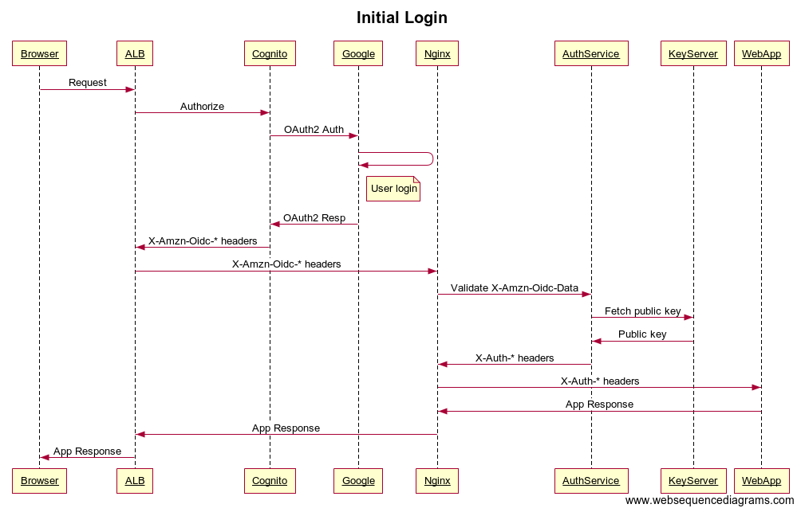
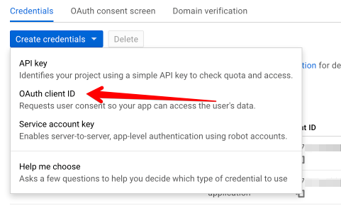
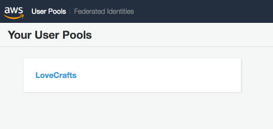
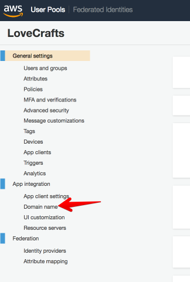
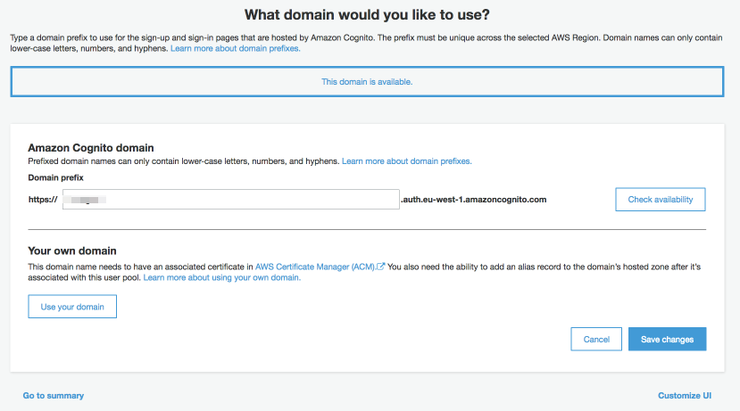

# Quick and easy BeyondCorp BackOffice access with ALBs, Cognito and Gsuite

For some values for quick and easy.

## Overview

LoveCrafts have several services which are currently hosted behind a VPN. VPN access is managed via LDAP which is managed by Engineering/DevOps.

Historically we have not been notified of company leavers in a timely fashion, which is an obvious security hole, as VPN access (can) permit access to privileged resources within our hosting environment.

This includes but is not limited to

* Grafana
* Kibana
* Jenkins

For a while we had been discussing some kind of Single Sign On (SSO) system to manage access to all these disparate systems. We use Google GSuite for corporate mail and our Human Resources Team add and remove people as they join and leave, including contractors. So it seemed the obvious system to treat as our single source of truth (or as good as we have for now anyway).

In June 2018 AWS announced the integration of Cognito and JWT Authorisation within their ALBs. <a name="ref1-return" ></a>[[1]](#ref1)

This would allow any Web Based back office services to be put behind a public facing ALB with Cognito Authorisation via GSuite.

This probably equates to 90% of our corporate VPN traffic. Theoretically we should be able to get the required VPN services to be used only for emergency SSH/RDP only. And we should limit SSH access as much as possible with other tooling.

Integrating with GSuite gets LoveCrafts significantly closer to a full SSO
Evaluation

## Proof of concept

A testing AWS account was choosen and we created

* Cognito User Pool
* Cognito App Client
* Application Load Balancer (ALB)
* Google OAuth2 Client Credentials

The ALB was configured in a testing account and added as a separate CNAME to an existing service.

The Google OAuth2 Client credentials were configured and added to the Cognito User Pool in the testing account.

Enabling the authentication, all access to the ALB was directed to a Google auth page and redirected back to the ALB once sign in was complete.

Transparent access worked fine, and a user was added to the Cognito Pool.

Access was allowed to the protected resource.

### The Good

Works transparently without having to write any app specific code. Zero to up and running in ~5mins.

AWS ALB passes the user profile data in a X-Amzn-Oidc-Data header that the app/nginx etc can access (although it is base64 encoded json)

### The Bad

Any Google account permits access. (This service is designed to allow app developers to pass off user management to Google, Twitter, Facebook or any OAuth2/OpenID platform.)

The App needs to validate JWT Token to prove authenticity of the X-Amzn-Oidc-Data header which leads onto....

### The Ugly

Initially it was relatively trivial to get Nginx to decode the X-Amzn-Oidc-Data Header, extract the Username/email/firstname/lastname and pass as separate headers to the downstream app.

However you should really check the signature of the JWT token to ensure it's validity (in time (i.e, session is still valid) and that it hasn't been spoofed).

Amazon chose to use ES256 signatures for JWT, which the nginx lua library we've been using doesn't support. And I couldn't find anyone (except a Kong version of nginx) which did support any Elliptical Curve Crypto signatures.

What follows is the deep-dive on the solution I ended up writing, a python sidecar to handle the JWT validation and userdata extraction and encapsulated the functionality in a new lua extension for nginx.

Once/If the nginx lua implementation improves to support ES crypto this should be deprecated in favour of a fully lua based function.

## Full Implementation

To follow along you will need:

* A Google GSuite account and developer access
* An AWS account with an ALB and a Cognito Pool
* nginx with lua support
* python3

We're going to build a python3 sidecar AuthService that validates the JWT token and passes the validated headers back to nginx. Nginx will then forward those headers to your own application behind the ALB.

The `AuthService` sidecar runs locally along side the Nginx instance and has strictly controlled timeouts. If the JWT authorisation is required and the service is down, nginx will serve a `503: Service Unavailable`.

Below shows the standard request path for an initial login to a Cognito ALB.



**Nginx** and **AuthServices** are the two components we need to build to validate the JWT token.

### Creating GSuite OAuth2 Credentials

Login into the [Google Developers Console](https://console.developers.google.com/apis/credentials) and create an app to use for authentication.

Create OAuth Client Credentials for your app.



Create a set of web application credentials.


Copy your `Client ID` add `Secret`


### Configure Cognito

If you don't already have a `Cognito User Pool` create one.


Choose the domain name that Cognito will reserve for you. This is where your users will get directed to to login. (You can use your own domain, but is beyond the scope of this tutorial.)


Pick your domain prefix. 

**N.B.** The full domain needs to added the Google Developer Console as a permitted Callback location for your Oauth Web Client app.


Configure Google as your identify provider. 
Paste in your `Client ID` and `Secret` from Google here.


Configure the ALB Endpoints for the Cognito Appl Client.


If, for example, your test application is being hosted on `testapp.mycorp.com`. 

Your Callback urls will be `https://testapp.mycorp.com,https://testapp.mycorp.com/oauth2/idpresponse`

The `/oauth2/idpresponse` url is handled by the ALB internally and your app will not see these requests.

Your Sign out URL will be `https://testapp.mycorp.com`

You can keep appending more ALBs and endpoints to this config later, comma separated.

### Configure ALB

Now we can configure the ALB to force authentication when accessing all or part of our Webapp.

From this point on, the ALB *only* ensures that there a valid session with *any* Google account, even a personal one. There is no way to restrict which email domains to permit in Cognito.

### Configure Nginx

To enable AWS JWT features in an application, firstly you will need nginx running with lua support and the `resty.http` lua package available and this custom lua script:

[nginx-aws-jwt.lua](nginx-aws-jwt.lua)

Our code is configured and managed by puppet, so you will need to substitute some values with appropriate values (timeouts, valid_domains etc.)

Inside your `http` configuration:

```nginx
lua_package_path "<<path_to_lua_packages>>/?.lua;;";
```


Add the following `access_by_lua` code to your location block:

```nginx
location / {
     access_by_lua '
         local jwt = require("nginx-aws-jwt")
         jwt.auth{auth_req=false}
     ';
}
```

auth_req defaults to true. If true, this will issue a 401 Access denied unless a valid AWS JWT token exists and the user's email address is in the list of `valid_domains` e.g. (`mycorp.com, myparentcorp.com`)

The false setting as shown enables a soft launch, and will instrument the backend request if a valid JWT token is present, and otherwise permit access as normal.

The only other parameter current supported is valid_domains. And should be used as such.

```nginx
location / {
    access_by_lua '
        local jwt = require("nginx-aws-jwt")
        jwt.auth{valid_domains="mycorp.com,megacorp.com,myparentcorp.com"}
    ';
}
```

The above example would permit any users from the three defined domains access.

### ALB

The ALB configuration should be include as normal in a CloudFormation Template.

Currently CloudFormation doesn't support ALB authenticate-oidc or authenticate-cognito target types, so they will need to be updated manually after initial deployment.


```bash
2018/06/14 12:54:50 [error] 26660#26660: *66 [lua] nginx-aws-jwt.lua:49: auth(): Invalid user/data in  X-Amzn-Oidc-Data header: No valid email domain, client: 192.168.33.11, server: only-smiles.loveknitting.com, request: "GET / HTTP/1.1", host: "only-smiles.loveknitting.com.dev.lovecrafts.cool"
```

### awsjwtauth sidecar service

The AWS JWT service logs are contained at

/var/log/lovecrafts/awsjwtauth/app.log

examples are:

```bash
[2018-06-14 13:24:53,367] [WARNING] Unauthorised access by: personal_email@gmail.com
# When a user not in the valid_domains list attempts to access.
 
[2018-06-14 15:06:59,162] [ERROR] Error Validating JWT Header: Invalid crypto padding
# Several variants on the above, based on signature failures, corrupted/tampered headers etc.
 
[2018-06-12 15:50:20,001] [INFO] No JWT Header present
# INFO messaging only in dev, useful for debugging.
```

## Monitoring

### Nginx / Webapp

The Nginx metrics or downsteam app metrics should be monitored as normal and should be un-affected
awsjstauth

The authentication sidecar app generate statsd metrics published to the local statsd collector prefixed with `awsjwtauth`

This includes counts of error conditions and success methods, app restarts etc.

It will also send timing information for it's only downstream dependency the AWS ALB Keyserver service.

Post example data to your service (this work in dev/vagrant fine)

```bash
curl -v https://only-smiles.loveknitting.com.dev.lovecrafts.cool/ \
  -H 'X-Amzn-Oidc-Data: eyJ0eXAiOiJKV1QiLCJraWQiOiJhYTQwY2Q0YS00YmEyLTQyOTMtYmZlMy1kM2ZmMmViZjgxYWIiLCJhbGciOiJFUzI1NiIsImlzcyI6Imh0dHBzOi8vY29nbml0by1pZHAuZXUtd2VzdC0xLmFtYXpvbmF3cy5jb20vZXUtd2VzdC0xX1dhc0RvRU5aZiIsImNsaWVudCI6IjFub3Iwa3NtMDhrcnFuOGtlcGcxZWFhNHVmIiwic2lnbmVyIjoiYXJuOmF3czplbGFzdGljbG9hZGJhbGFuY2luZzpldS13ZXN0LTE6NDcyNzg2NDA0OTE1OmxvYWRiYWxhbmNlci9hcHAvYXV0aC10ZXN0LzJjYzEwY2Y2ODFiYjQ0MDEiLCJleHAiOjE1Mjg0Njg0NDl9.eyJzdWIiOiI3MjNmZGY3Ni1iYTliLTQ2MTUtYjdmYi1jMjM4MjliYTkzZGQiLCJpZGVudGl0aWVzIjoiW3tcInVzZXJJZFwiOlwiMTEwMDI1MjMxMTIzOTE0NzUyNjkwXCIsXCJwcm92aWRlck5hbWVcIjpcIkdvb2dsZVwiLFwicHJvdmlkZXJUeXBlXCI6XCJHb29nbGVcIixcImlzc3VlclwiOm51bGwsXCJwcmltYXJ5XCI6dHJ1ZSxcImRhdGVDcmVhdGVkXCI6MTUyODQ2ODA2MDg5MX1dIiwiZ2l2ZW5fbmFtZSI6IkJvYiIsImZhbWlseV9uYW1lIjoiQnJvY2todXJzdCIsImVtYWlsIjoiYm9iQGxvdmVrbml0dGluZy5jb20iLCJwaWN0dXJlIjoiaHR0cHM6Ly9saDUuZ29vZ2xldXNlcmNvbnRlbnQuY29tLy1XYmVvc0Y1Y0Z1Zy9BQUFBQUFBQUFBSS9BQUFBQUFBQUFCVS9hSWYtS29Ybmx2OC9zOTYtYy9waG90by5qcGciLCJ1c2VybmFtZSI6Ikdvb2dsZV8xMTAwMjUyMzExMjM5MTQ3NTI2OTAifQ==.O2Z5DorTvpXHq/ICDytR85aWgcRvDj4ae3TKf35JfwADcHa7sbFpLADZqcF7K5ahln7zw1W7YZG+ZnFc4LNorw=='
```

The response should be shown as normal.

To inspect what was added to the backend request:

```bash
sudo ngrep -q -W byline -d any '' dst port 8080
```

Response below:

```bash
T 192.168.33.11:9254 -> 192.168.33.11:8080 [AP]
GET / HTTP/1.1.
Host: only-smiles.loveknitting.com.dev.lovecrafts.cool.
X-Forwarded-For: 192.168.33.11.
X-Forwarded-Proto: https.
X-Forwarded-Port: 443.
User-Agent: curl/7.47.1.
Accept: */*.
X-Amzn-Oidc-Data: eyJ0eXAiOiJKV1QiLCJraWQiOiJhYTQwY2Q0YS00YmEyLTQyOTMtYmZlMy1kM2ZmMmViZjgxYWIiLCJhbGciOiJFUzI1NiIsImlzcyI6Imh0dHBzOi8vY29nbml0by1pZHAuZXUtd2VzdC0xLmFtYXpvbmF3cy5jb20vZXUtd2VzdC0xX1dhc0RvRU5aZiIsImNsaWVudCI6IjFub3Iwa3NtMDhrcnFuOGtlcGcxZWFhNHVmIiwic2lnbmVyIjoiYXJuOmF3czplbGFzdGljbG9hZGJhbGFuY2luZzpldS13ZXN0LTE6NDcyNzg2NDA0OTE1OmxvYWRiYWxhbmNlci9hcHAvYXV0aC10ZXN0LzJjYzEwY2Y2ODFiYjQ0MDEiLCJleHAiOjE1Mjg0Njg0NDl9.eyJzdWIiOiI3MjNmZGY3Ni1iYTliLTQ2MTUtYjdmYi1jMjM4MjliYTkzZGQiLCJpZGVudGl0aWVzIjoiW3tcInVzZXJJZFwiOlwiMTEwMDI1MjMxMTIzOTE0NzUyNjkwXCIsXCJwcm92aWRlck5hbWVcIjpcIkdvb2dsZVwiLFwicHJvdmlkZXJUeXBlXCI6XCJHb29nbGVcIixcImlzc3VlclwiOm51bGwsXCJwcmltYXJ5XCI6dHJ1ZSxcImRhdGVDcmVhdGVkXCI6MTUyODQ2ODA2MDg5MX1dIiwiZ2l2ZW5fbmFtZSI6IkJvYiIsImZhbWlseV9uYW1lIjoiQnJvY2todXJzdCIsImVtYWlsIjoiYm9iQGxvdmVrbml0dGluZy5jb20iLCJwaWN0dXJlIjoiaHR0cHM6Ly9saDUuZ29vZ2xldXNlcmNvbnRlbnQuY29tLy1XYmVvc0Y1Y0Z1Zy9BQUFBQUFBQUFBSS9BQUFBQUFBQUFCVS9hSWYtS29Ybmx2OC9zOTYtYy9waG90by5qcGciLCJ1c2VybmFtZSI6Ikdvb2dsZV8xMTAwMjUyMzExMjM5MTQ3NTI2OTAifQ==.O2Z5DorTvpXHq/ICDytR85aWgcRvDj4ae3TKf35JfwADcHa7sbFpLADZqcF7K5ahln7zw1W7YZG+ZnFc4LNorw==.
X-LC-Sid: 0853f9337e43939dd9f9958d52e1e7071f0dbd0f.
X-LC-Rid: 32b7a250d44e9c354f2ebedbebf58c5de4f19767.
X-Auth-Family-name: Brockhurst.
X-Auth-Email: bob@loveknitting.com.
X-Auth-Given-name: Bob.
X-Auth-Picture: https://lh5.googleusercontent.com/-WbeosF5cFug/AAAAAAAAAAI/AAAAAAAAABU/aIf-KoXnlv8/s96-c/photo.jpg.
.
```

If the validation fails or is not present the `X-Auth-*` Headers will not be present.

## References

### AWS Documentation

<a name="ref1" >[1]</a> - [[back]](#ref1-return) -
https://aws.amazon.com/blogs/aws/built-in-authentication-in-alb/

<a name="ref2" >[2]</a> - [[back]](#ref2-return) - 
https://docs.aws.amazon.com/cognito/latest/developerguide/developer-authenticated-identities.html

<a name="ref3" >[3]</a> - [[back]](#ref3-return) - 
https://docs.aws.amazon.com/elasticloadbalancing/latest/application/listener-authenticate-users.html

Google OpenID Parameters:

https://accounts.google.com/.well-known/openid-configuration
